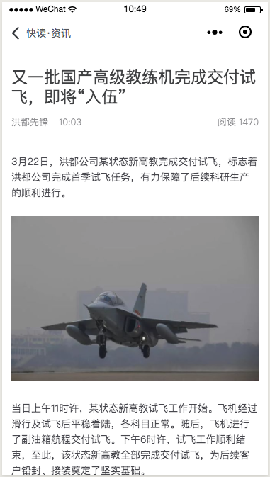

# News - WeChat Mini Program

## Table of Contents
- English Version
    1. [Overview](#Overview)
    2. [Target](#Target)
    3. [Rubric](#Rubric)
    
- 简体中文版
    1. [概述](#概述)
    2. [目标](#目标)
    3. [审阅](#审阅)

---
## Overview

This project gets news from the database and presents it as a list. You can display a list of hot news from different categories, or click to view the detail of news. You can use [Prepared API](./news_api.md) or use real news data.

The Mockups are listed below

Figure 1: News List&emsp; &nbsp; &nbsp; &nbsp; &emsp; &nbsp; &nbsp; &nbsp; Figure 2: News Detail

## Target

- Design and Code WeChat Mini Program in accordance with mockups
- Learn to code list and display contents as categories in WeChat Mini Program

## Rubric

### Layout

| CRITERIA | MEETS SPECIFICATIONS |
| :-- | :-- |
| Main Interface | The app contains a main interface to show the news lists under different categories. The app must contain icons and titles. |
| List Page | Each list item in the main interface displays the title, author, and time of the news. Images should also be included if available. Note that not all responses contain image data, but if you have this data, you need to include it. Otherwise use a default image instead. |
| Detail Page | The detail page should contain the title, author, time of publication, number of readings, and body of the news. If the relevant news contains picture information, the picture should be displayed. If the picture has a picture name and source, it should be displayed below the picture. |

### Functionality

| CRITERIA | MEETS SPECIFICATIONS |
| :-- | :-- |
| Execute Request & Get Response | Execute Resquest and get response data needed. |
| Error | Running code without errors. |
| Navigate To Detail Page | The app can navigate from the List Page to Detail Page. |
| Navigate Back to List Page | The app can navigate back to List Page. |
| Pull-down Refresh | The pull-down gesture activates the refresh function. |

### Code

| CRITERIA | MEETS SPECIFICATIONS |
| :-- | :-- |
| Readability | The code should be easy to read, making it easier for other developers to understand their meaning and functionality when reading the code. |
| Format | The code should have a canonical format, ie no extra blank lines, no unused variables or methods, no uncommented code. |
| Comment | Contains comments to effectively illustrate a long work flow.                         |
| Specific Function | Use `wx:for` to dynamic display the catogories of news, such as（`Local`，`Global`，`Finance`，`Entertainment`，`Military`，`Sports` 和 `Other`）。 |

---
## 概述

本项目从数据库中获取新闻，并以列表方式呈现。可以显示不同门类的热点新闻列表，也可以点击访问具体的新闻内容。可以使用[准备好的 API](./news_api.md)，也可以使用真实的新闻数据。

下图为小程序样式参考

图1.小程序“国内新闻”列表页&emsp; &nbsp; &nbsp; &nbsp; &emsp; &nbsp; &nbsp; &nbsp; 图2.小程序“国际新闻”详情页

## 目标

- 设计并编写小程序，完成显示任务
- 学会小程序中列表、分类图文显示的功能

## 审阅

### 布局

|          标准           | 符合要求                                                     |
| :---------------------: | :----------------------------------------------------------- |
|         主界面          | 应用包含一个主界面，来展示不同分类下的新闻列表。小程序必须包含图标及题目。 |
| 列表项内容 &nbsp;&nbsp; | 主界面的每个列表项都显示有关该新闻的标题，作者以及发布时间。如果可以获取的 话，图片也应包括在内。请注意，并非所有的响应都包含图片数据，但如果有此数据 ，则需要将其包含在内。否则使用一张默认图片来代替。 |
|        详情界面         | 详情界面应包含有关该新闻的标题，作者，发布时间，阅读数以及正文。如相关新闻 含有图片信息，则显示图片，如图片有图名及来源，则显示在图片下方。 |

### 功能

|          标准          | 符合要求                                                     |
| :--------------------: | :----------------------------------------------------------- |
| 执行请求与 获取数据 | 请求执行并且取得需要的数据。                                 |
|          错误          | 代码运行没有错误。                                           |
|      跳转到详情页      | 可以从主界面的列表项跳转到对应新闻的详情页。 &nbsp;&nbsp;&nbsp;&nbsp; |
|      返回到主界面      | 可以从新闻详情页返回到主界面。                               |
|        手势刷新        | 下拉手势激活刷新功能。                                       |

### 代码

|                           标准                           | 符合要求                                                     |
| :------------------------------------------------------: | :----------------------------------------------------------- |
|                          可读性                          | 代码应该易于阅读，方便其它开发者在阅读代码时更容易的理解它们的含义和功能。 |
| &nbsp;&nbsp;&nbsp;&nbsp;代码规范&nbsp;&nbsp;&nbsp;&nbsp; | 代码应该有规范的格式，即没有多余空行、没有未使用的变量或方法、没有未注释的 代码。 |
|                           注释                           | 含有注释，以有效说明很长的代码流程。                         |
|                           编码                           | 使用 `wx:for` 动态的显示新闻分类部分（`国内`，`国际`，`财经`，`娱乐`，`军事`，`体育` 和 `其他`）。 |
